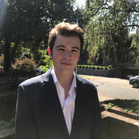

# Spencer Boat

[GitHub](https://github.com/floatyboat)

[LinkedIn](https://www.linkedin.com/in/spencerboat/)

## Work Experience

### [Ruffalo Noel Levitz](https://www.ruffalonl.com/)
* Engagement Supervisor (2020 - Present)
  * Supervise team of callers fundraising for the University of Washington
  * Train new callers
* Engagement Ambassador (2018 - 2020)
  * Make calls to alumni to raise funds for the various programs at the University of Washington
  * Over $100k personally raised for UW
  * Over $1 million rasied in total in 2019

### [The Rockademy](https://www.therockademy.com/)
* Director's Assistant (2015 - 2017)
  * Instruct young children to play songs as a band and conduct live performances
* Studio Guitarist (2015 - 2017)
  * Fill in as a guitar or bass player for bands for recording and live performances

## Education

### University of Washington (Seattle, Washington)

* Geography - Data Science (2017 - 2021)
* 3.6 GPA

### Torrey Pines High School (San Diego, California)

* 2013 - 2017
* 4.4 GPA
* President's Club
